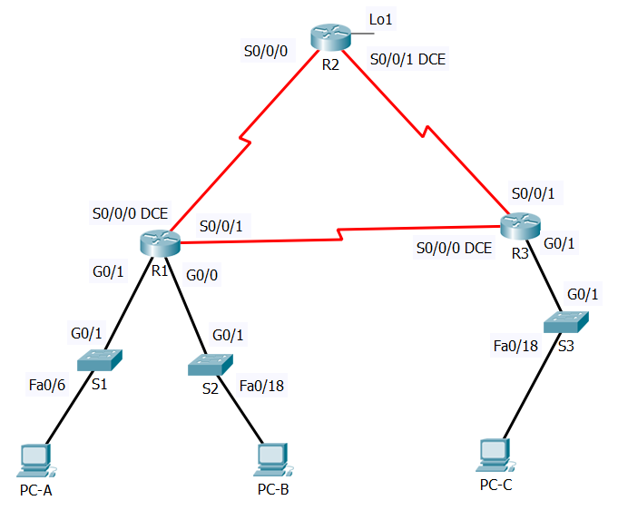

| **Academiejaar 2018-2019 1e examenperiode**                                   |                                             |
|-------------------------------------------------------------------------------|---------------------------------------------|
| Faculteit: FBO                                                                | Examendatum: / 12 / 2018                    |
| **Naam en voornaam student: Van den Hauwe Thomas**                            |                                             |
| Studentennummer: 201427877                                                    |                                             |
| Lector bij wie de student de onderwijsactiviteit volgde: Karine Van Driessche | Lesgroep v/d onderwijsactiviteit: TIN 3TILE |
| **Behaald resultaat: \______\_ op \______\_**                                 |                                             |

>   Opleiding, afstudeerrichting en jaar: TIN 3

>   Naam van het opleidingsonderdeel: Projecten Systeembeheer 3

>   (Eventueel) dOLOD / Deelexamen: LABO

>   Campus: TILE

>   Lector(en): Karine Van Driessche

>   Aanvangsuur examen:

**Gegeven:**

Volgende opstelling

Bijbehorende adressentabel:

| **Device**   | **Interface** | **IP Address**        | **Default Gateway** |
|--------------|---------------|-----------------------|---------------------|
| R1 (FE80::1) | S0/0/0(DCE)   | 2001:DB8:AAAA:1::1/64 | N/A                 |
|              | S0/0/1        | 2001:DB8:AAAA:3::1/64 | N/A                 |
|              | G0/0          | 2001:DB8:ACAD:B::1/64 | N/A                 |
|              | G0/1          | 2001:DB8:ACAD:A::1/64 | N/A                 |
| R2 (FE80::2) | S0/0/0        | 2001:DB8:AAAA:1::2/64 | N/A                 |
|              | S0/0/1(DCE)   | 2001:DB8:AAAA:2::2/64 | N/A                 |
|              | Lo1           | 2001:DB8:AAAA:4::1/64 | N/A                 |
| R3 (FE80::3) | S0/0/0(DCE)   | 2001:DB8:AAAA:3::2/64 | N/A                 |
|              | S0/0/1        | 2001:DB8:AAAA:2::1/64 | N/A                 |
|              | G0/1          | 2001:DB8:CAFE:C::1/64 | N/A                 |
| S1           | VLAN1         | 2001:DB8:ACAD:A::A/64 | N/A                 |
| S2           | VLAN1         | 2001:DB8:ACAD:B::A/64 | N/A                 |
| S3           | VLAN1         | 2001:DB8:ACAD:C::A/64 | N/A                 |
| PC-A         | NIC           | 2001:DB8:ACAD:A::3/64 | FE80::1             |
| PC-B         | NIC           | 2001:DB8:ACAD:B::3/64 | FE80::1             |
| PC-C         | NIC           | 2001:DB8:ACAD:C::3/64 | FE80::3             |

**DEEL 1: maak de netwerkopstelling en initialiseer de toestellen**

*Stap 1:* bouw de netwerkopstelling uit overeenkomstig de gegeven topologie

*Stap 2:* initialiseer of reload eventueel de routers en switchen: zorg er dus
voor dat er geen oude configuratie meer op de toestellen staat

**DEEL 2: configureer alle toestellen en controleer de verbindingen**

*Stap 1: configureer de IPv6 adressen op alle PC’s*

Configureer de IPv6 global unicast adressen overeenkomstig de gegeven
adressentabel. Gebruik het link-local adres als default-gateway op alle Pc’s.

*Stap 2: configureer de switchen*

a. Maak DNS lookup ongedaan.

b. Configureer een hostname.

c. Wijs volgende domeinnaam toe: **ccna-lab.com**.

d. Encrypteer de plain-text paswoorden.

e. Maak een MOTD banner die de gebruikers waarschuwt : “Toegang voor onbevoegden
is verboden”.

f. Maak een lokale user database met een gebruikersnaam **admin** en paswoord
**classadm**.

g. Configureer **class** als het privileged EXEC geëncrypteerd paswoord.

h. Configureer **cisco** als het console paswoord en maak login mogelijk.

i. Maak login op de VTY lijnen mogelijk door gebruik te maken van de lokale
database.

j. Genereer een crypto rsa key voor ssh, gebruik makend van een modulus grootte
van 1024 bits.

k. Verander de transport input op alle VTY lijnen naar alleen SSH en Telnet.

l. Wijs een IPv6 adres toe aan VLAN 1 overeenkomstig de adrestabel.

**Voeg hier tussen de runningconfiguration file van S1.**

S1\#show run

Building configuration...

Current configuration : 1335 bytes

!

version 12.2

no service timestamps log datetime msec

no service timestamps debug datetime msec

service password-encryption

!

hostname S1

!

enable secret 5 \$1\$mERr\$9cTjUIEqNGurQiFU.ZeCi1

!

!

!

ip ssh version 2

no ip domain-lookup

ip domain-name ccna-lab.com

!

username admin privilege 1 password 7 0822404F1A0A04131F

!

!

spanning-tree mode pvst

spanning-tree extend system-id

!

interface FastEthernet0/1

!

interface FastEthernet0/2

!

interface FastEthernet0/3

!

interface FastEthernet0/4

!

interface FastEthernet0/5

!

interface FastEthernet0/6

!

interface FastEthernet0/7

!

interface FastEthernet0/8

!

interface FastEthernet0/9

!

interface FastEthernet0/10

!

interface FastEthernet0/11

!

interface FastEthernet0/12

!

interface FastEthernet0/13

!

interface FastEthernet0/14

!

interface FastEthernet0/15

!

interface FastEthernet0/16

!

interface FastEthernet0/17

!

interface FastEthernet0/18

!

interface FastEthernet0/19

!

interface FastEthernet0/20

!

interface FastEthernet0/21

!

interface FastEthernet0/22

!

interface FastEthernet0/23

!

interface FastEthernet0/24

!

interface GigabitEthernet0/1

!

interface GigabitEthernet0/2

!

interface Vlan1

no ip address

!

banner motd \^CToegang voor onbevoegden is verboden\^C

!

!

!

line con 0

password 7 0822455D0A16

login local

!

line vty 0 4

login local

line vty 5 15

login local

!

!

!

!

end

*Stap 3: configureer de basisinstellingen op alle routers*

a. Maak DNS lookup ongedaan.

b. Configureer een hostname.

c. Wijs volgende domeinnaam toe: **ccna-lab.com**.

d. Encrypteer de plain-text paswoorden.

e. Maak een MOTD banner die de gebruikers waarschuwt : “Toegang voor onbevoegden
is verboden”.

f. Maak een lokale user database met een gebruikersnaam **admin** en paswoord
**classadm**.

g. Configureer **class** als het privileged EXEC geëncrypteerd paswoord.

h. Configureer **cisco** als het console paswoord en maak login mogelijk.

i. Maak login op de VTY lijnen mogelijk door gebruik te maken van de lokale
database.

j. Genereer een crypto rsa key voor ssh, gebruik makend van een modulus grootte
van 1024 bits.

k. Verander de transport input op alle VTY lijnen naar alleen SSH en Telnet.

*Stap 4: configureer IPv6 instellingen op R1*

a. Configureer de IPv6 unicast adressen op de volgende interfaces: G0/0, G0/1,
S0/0/0 en S0/0/1.

b. Configureer de IPv6 link-local adressen op de volgende interfaces: G0/0,
G0/1, S0/0/0 en S0/0/1. Gebruik **FE80::1** voor de link-local adressen op alle
vier interfaces.

c. Zet de clock rate op S0/0/0 op 128000.

d. Zorg ervoor dat de interfaces IPv6-pakketten kunnen versturen.

e. Maak IPv6 unicast routing mogelijk.

f. Configureer OSPFv3 op R1 en zorg dat de LAN-interfaces passieve interfaces
zijn.

**Voeg hier tussen de runningconfiguration file van R1.**

R1\#show run

Building configuration...

Current configuration : 1588 bytes

!

version 15.1

no service timestamps log datetime msec

no service timestamps debug datetime msec

service password-encryption

!

hostname R1

!

!

!

enable secret 5 \$1\$mERr\$9cTjUIEqNGurQiFU.ZeCi1

!

!

!

!

!

!

no ip cef

ipv6 unicast-routing

!

no ipv6 cef

!

!

!

username admin password 7 0822404F1A0A04131F

!

!

license udi pid CISCO1941/K9 sn FTX1524K4X4-

!

!

!

!

!

!

!

!

!

ip ssh version 2

no ip domain-lookup

ip domain-name ccna-lab.com

!

!

spanning-tree mode pvst

!

!

!

!

!

!

interface Loopback0

no ip address

shutdown

!

interface GigabitEthernet0/0

no ip address

duplex auto

speed auto

ipv6 address FE80::1 link-local

ipv6 address 2001:DB8:ACAD:B::1/64

ipv6 enable

ipv6 ospf 10 area 0

!

interface GigabitEthernet0/1

no ip address

duplex auto

speed auto

ipv6 address FE80::1 link-local

ipv6 address 2001:DB8:ACAD:A::1/64

ipv6 enable

ipv6 ospf 10 area 0

!

interface Serial0/0/0

no ip address

ipv6 address FE80::1 link-local

ipv6 address 2001:DB8:AAAA:1::1/64

ipv6 enable

ipv6 ospf 10 area 0

clock rate 128000

!

interface Serial0/0/1

no ip address

ipv6 address FE80::1 link-local

ipv6 address 2001:DB8:AAAA:3::1/64

ipv6 enable

ipv6 ospf 10 area 0

!

interface Vlan1

no ip address

shutdown

!

ipv6 router ospf 10

router-id 1.1.1.1

log-adjacency-changes

passive-interface GigabitEthernet0/0

passive-interface GigabitEthernet0/1

!

ip classless

!

ip flow-export version 9

!

!

!

banner motd \^CToegang voor onbevoegden is verboden\^C

!

!

!

!

!

line con 0

password 7 0822455D0A16

login local

!

line aux 0

!

line vty 0 4

login local

line vty 5 15

login local

!

!

!

end

*Stap 5: configureer IPv6 instellingen op R2*

a. Configureer de IPv6 unicast adressen op de volgende interfaces: Lo1, S0/0/0
en S0/0/1.

b. Configureer de IPv6 link-local adressen op de volgende interfaces: S0/0/0 en
S0/0/1. Gebruik **FE80::2** voor de link-local adressen op alle twee interfaces.

c. Zet de clock rate op S0/0/1 op 128000.

d. Zorg ervoor dat de interfaces IPv6-pakketten kunnen versturen.

e. Maak IPv6 unicast routing mogelijk.

f. Maak een default route die gebruik maakt van de loopback interface Lo1 (deze
dient ter simulatie van een internetconnectie).

g. Configureer OSPFv3 op R2 en zorg dat de default route doorgegeven wordt op de
andere routers van het domein.

**Voeg hier tussen de runningconfiguration file van R2.**

R2\#show running-config

Building configuration...

Current configuration : 1547 bytes

!

version 15.1

no service timestamps log datetime msec

no service timestamps debug datetime msec

service password-encryption

!

hostname R2

!

!

!

enable secret 5 \$1\$mERr\$9cTjUIEqNGurQiFU.ZeCi1

!

!

!

!

!

!

no ip cef

ipv6 unicast-routing

!

no ipv6 cef

!

!

!

username admin password 7 0822404F1A0A04131F

!

!

license udi pid CISCO1941/K9 sn FTX15243P6U-

!

!

!

!

!

!

!

!

!

ip ssh version 2

no ip domain-lookup

ip domain-name ccna-lab.com

!

!

spanning-tree mode pvst

!

!

!

!

!

!

interface Loopback0

no ip address

shutdown

!

interface Loopback1

no ip address

ipv6 address 2001:DB8:AAAA:4::1/64

ipv6 enable

ipv6 ospf network point-to-point

!

interface GigabitEthernet0/0

no ip address

duplex auto

speed auto

shutdown

!

interface GigabitEthernet0/1

no ip address

duplex auto

speed auto

shutdown

!

interface Serial0/0/0

no ip address

ipv6 address FE80::2 link-local

ipv6 address 2001:DB8:AAAA:1::2/64

ipv6 enable

ipv6 ospf 10 area 0

!

interface Serial0/0/1

no ip address

ipv6 address FE80::2 link-local

ipv6 address 2001:DB8:AAAA:2::2/64

ipv6 enable

ipv6 ospf 10 area 0

clock rate 128000

!

interface Vlan1

no ip address

shutdown

!

ipv6 router ospf 10

router-id 2.2.2.2

default-information originate

log-adjacency-changes

!

ipv6 router ospf 1

log-adjacency-changes

!

ip classless

!

ip flow-export version 9

!

ipv6 route ::/0 Loopback1

!

!

banner motd \^CToegang voor onbevoegden is verboden\^C

!

!

!

!

!

line con 0

password 7 0822455D0A16

login local

!

line aux 0

!

line vty 0 4

login local

line vty 5 15

login local

!

!

!

end

*Stap 6: configureer IPv6 instellingen op R3*

a. Configureer de IPv6 unicast adressen op de volgende interfaces: G0/1, S0/0/0
en S0/0/1.

b. Configureer de IPv6 link-local adressen op de volgende interfaces: G0/1,
S0/0/0 en S0/0/1. Gebruik **FE80::3** voor de link-local adressen op alle drie
interfaces.

c. Zet de clock rate op S0/0/0 op 128000.

d. Zorg ervoor dat de interfaces IPv6-pakketten kunnen versturen.

e. Maak IPv6 unicast routing mogelijk.

f. Configureer OSPFv3 op R3 en maak van de LAN-interface een passieve interface.

**Voeg hier tussen de runningconfiguration file van R3.**

R3\#show running-config

Building configuration...

Current configuration : 1410 bytes

!

version 15.1

no service timestamps log datetime msec

no service timestamps debug datetime msec

service password-encryption

!

hostname R3

!

!

!

enable secret 5 \$1\$mERr\$9cTjUIEqNGurQiFU.ZeCi1

!

!

!

!

!

!

no ip cef

ipv6 unicast-routing

!

no ipv6 cef

!

!

!

username admin password 7 0822404F1A0A04131F

!

!

license udi pid CISCO1941/K9 sn FTX152404T2-

!

!

!

!

!

!

!

!

!

ip ssh version 2

no ip domain-lookup

ip domain-name ccna-lab.com

!

!

spanning-tree mode pvst

!

!

!

!

!

!

interface GigabitEthernet0/0

no ip address

duplex auto

speed auto

shutdown

!

interface GigabitEthernet0/1

no ip address

duplex auto

speed auto

ipv6 address FE80::3 link-local

ipv6 address 2001:DB8:ACAD:C::1/64

ipv6 enable

ipv6 ospf 10 area 0

!

interface Serial0/0/0

no ip address

ipv6 address FE80::3 link-local

ipv6 address 2001:DB8:AAAA:3::2/64

ipv6 enable

ipv6 ospf 10 area 0

clock rate 128000

!

interface Serial0/0/1

no ip address

ipv6 address FE80::3 link-local

ipv6 address 2001:DB8:AAAA:2::1/64

ipv6 enable

ipv6 ospf 10 area 0

!

interface Vlan1

no ip address

shutdown

!

ipv6 router ospf 10

router-id 3.3.3.3

log-adjacency-changes

passive-interface GigabitEthernet0/1

!

ip classless

!

ip flow-export version 9

!

!

!

banner motd \^CToegang voor onbevoegden is verboden\^C

!

!

!

!

!

line con 0

password 7 0822455D0A16

login local

!

line aux 0

!

line vty 0 4

login local

line vty 5 15

login local

!

!

!

end

*Stap 7: Controleer de connectiviteit*

a. Elke PC zou in staat moeten zijn om te kunnen pingen naar de andere PC’s in
de topology.

b. Telnet naar R1 vanuit alle PC’s in de topology.

c. SSH naar R1 vanuit alle PC’s in de topology.

d. Telnet naar S1 vanuit alle PC’s in de topology.

e. SSH naar S1 vanuit alle PC’s in de topology.

f. Zorg ervoor dat nu alles werkt: troubleshoot indien nodig want de ACLs die je
zal maken in DEEL3 gaan de toegang beperken tot bepaalde zones van het netwerk

**Opmerking**: Tera Term vereist dat het bestemmings IPv6 adres tussen vierkante
haakjes staat. Voer het IPv6 adres in zoals in de figuur, klik op **OK** en
vervolgens op **Continue** om de beveiligingswaarschuwing te accepteren en te
connecteren met de router.

Voer de geconfigureerde gebruikerscredentials in (gebruikersnaam **admin** en
paswoord **classadm**) en selecteer de **Use plain password to log in** in de
SSH Authentication dialogue box. Klik op **OK** om verder te gaan.

**DEEL 3: Configureer en controleer IPv6 ACLs**

*Stap 1: Configureer en controleer VTY beperkingen op R1:*

a. Maak een (extended) ACL genaamd **RESTRICT-VTY** zodat alleen hosts van het
2001:db8:acad:a::/64 netwerk kunnen telnetten naar R1. Alle andere hosts kunnen
alleen gebruik maken van SSH om te connecteren met R1.

Voeg hier de configuratie van de ACL in:

R1(config)\# ipv6 access-list RESTRICT-VTY

R1(config-ipv6-acl)\# permit tcp 2001:DB8:ACAD:A::1/64 any eq telnet

R1(config-ipv6-acl)\# permit tcp any any eq ssh

b. Pas de RESTRICT-VTY ACL toe op de VTY lijnen van R1.

Geef de gebruikte commando’s

R1(config-ipv6-acl)\# line vty 0 15

R1(config-line)\# ipv6 access-class RESTRICT-VTY in

c. Toon de nieuwe ACL.

Geef het commando:

R1\# show ipv6 access-list RESTRICT-VTY

Geef de uitvoer van bovenstaand commando :

>   R1\#show ipv6 access-list

>   IPv6 access list RESTRICT-VTY

>   permit tcp 2001:DB8:ACAD:A::/64 any eq telnet (1 match(es))

>   permit tcp any any eq 22 (3 match(es))

d. Controleer dat de RESTRICT-VTY ACL alleen Telnet verkeer toelaat van het
2001:db8:acad:a::/64 netwerk.

*Stap 2: Beperk de Telnet-toegang tot het 2001:db8:acad:a::/64 netwerk:*

a. Maak een (extended) ACL genaamd **RESTRICTED-LAN** dat alle Telnet-toegang
tot het 2001:db8:acad:a::/64 netwerk blokkeert.

Voeg hier de configuratie van de ACL in:

R1(config)\# ipv6 access-list RESTRICTED-LAN

R1(config-ipv6-acl)\# permit tcp host 2001:DB8:ACAD:A::1 2001:DB8:ACAD:A::/64 eq
telnet

R1(config-ipv6-acl)\# deny tcp any 2001:DB8:ACAD:A::/64 eq telnet

R1(config-ipv6-acl)\# permit ipv6 any any

b. Pas de RESTRICTED-LAN ACL toe op de G0/1 interface van R1 voor al het
uitgaande verkeer.

Geef de gebruikte commando’s

R1(config)\# interface g0/1

R1(config-if)\# ipv6 traffic-filter RESTRICTED-LAN out

c. Telnet naar S1 van PC-B en PC-C om te controleren dat Telnet inderdaad
geblokkeerd wordt. Gebruik vervolgens SSH van PC-C naar S1 om te controleren dat
je via SSH wel nog S1 kan bereiken. Troubleshoot indien nodig.

d. Toon de nieuwe ACL.

Geef het commando:

R1\# show ipv6 access-list RESTRICTED-LAN

Geef de uitvoer van bovenstaand commando :

IPv6 access list RESTRICTED-LAN

permit tcp host 2001:DB8:ACAD:A::1 2001:DB8:ACAD:A::/64 eq telnet

deny tcp any 2001:DB8:ACAD:A::/64 eq telnet (24 match(es))

permit ipv6 any any (24 match(es))

Merk op dat in elke lijn het aantal hits of matches staat die zijn opgetreden
sinds de ACL was toegepast op de interface

e. Gebruik het **clear ipv6 access-list**-commando om de match-tellers te
resetten voor de RESRICTED-LAN ACL

R1\# **clear ipv6 access-list RESTRICTED-LAN**

f. Toon opnieuw de ACL om te controleren dat de tellers inderdaad terug op nul
staan.

Geef het commando:

R1\# show ipv6 access-list RESTRICTED-LAN

Geef de uitvoer van bovenstaand commando :

IPv6 access list RESTRICTED-LAN

permit tcp host 2001:DB8:ACAD:A::1 2001:DB8:ACAD:A::/64 eq telnet

deny tcp any 2001:DB8:ACAD:A::/64 eq telnet

permit ipv6 any any

**DEEL 4: Aanpassingen aan een IPv6 ACL**

Voordat je met de aanpassingen begint in de *RESTRICTED-LAN ACL*, verwijder je
best eerst de ACL van de interface.

*Stap 1: Verwijder de RESTRICTED-LAN ACL van de interface*

Geef de gebruikte commando’s

R1(config)\# interface g0/1

R1(config-if)\# no ipv6 traffic-filter RESTRICTED-LAN out

*Stap 2: Toon alle ACL*

Geef het commando:

R1\# show ipv6 access-list

Geef de uitvoer van bovenstaand commando :

IPv6 access list RESTRICT-VTY

permit tcp 2001:DB8:ACAD:A::/64 any eq telnet (1 match(es))

permit tcp any any eq 22 (3 match(es))

IPv6 access list RESTRICTED-LAN

permit tcp host 2001:DB8:ACAD:A::1 2001:DB8:ACAD:A::/64 eq telnet

deny tcp any 2001:DB8:ACAD:A::/64 eq telnet

permit ipv6 any any

*Stap 3: Voeg een nieuw ACL-statement toe door gebruik te maken van een
volgnummer*

R1(config)\# **ipv6 access-list RESTRICTED-LAN**

R1(config-ipv6-acl)\# **permit tcp 2001:db8:acad:b::/64 host 2001:db8:acad:a::a
eq 23 sequence 15**

Wat is het gevolg van deze nieuwe statement?

Het 2001:db8:acad:b::/64 subnet zal kunnen telnetten naar switch S1

*Stap 4: Voeg een nieuw ACL-statement toe aan het einde van de RESTRICTED-LAN
ACL*

R1(config-ipv6-acl)\# **permit tcp any host 2001:db8:acad:a::3 eq www**

**Opmerking**: Eigenlijk is deze statement overbodig. Deze wordt enkel gebruikt
om te tonen hoe een statement wordt toegevoegd aan het einde van een ACL.

*Stap 5: Toon opnieuw de ACLs om de veranderingen te controleren*

Geef de uitvoer van het commando:

IPv6 access list RESTRICT-VTY

permit tcp 2001:DB8:ACAD:A::/64 any eq telnet

permit tcp any any eq 22

IPv6 access list RESTRICTED-LAN

deny tcp any 2001:DB8:ACAD:A::/64 eq telnet

permit tcp 2001:DB8:ACAD:B::/64 host 2001:DB8:ACAD:A::A eq telnet

permit ipv6 any any

permit tcp any host 2001:DB8:ACAD:A::3 eq www

*Stap 6: Verwijder de laatst toegevoegde lijn in de RESTRICTED-LAN ACL*

Geef het gebruikte commando:

R1(config-ipv6-acl)\# no permit tcp any host 2001:db8:acad:a::3 eq www

*Stap 7: Toon opnieuw de RESTRICTED-LAN ACL om de veranderingen te controleren*

Geef het gebruikte commando:

R1(config-ipv6-acl)\# show ipv6 access-list RESTRICTED-LAN

Geef de uitvoer van het commando:

IPv6 access list RESTRICTED-LAN

deny tcp any 2001:DB8:ACAD:A::/64 eq telnet

permit tcp 2001:DB8:ACAD:B::/64 host 2001:DB8:ACAD:A::A eq telnet

permit ipv6 any any

*Stap 8: Pas opnieuw de RESTRICTED-LAN ACL toe op de interface G0/1*

Geef de gebruikte commando’s:

R1(config)\# interface g0/1

R1(config-if)\# ipv6 traffic-filter RESTRICTED-LAN out

*Stap 9: Test de veranderingen van de ACL.*

Telnet naar S1 vanuit PC-B. Troubleshoot indien nodig.
